# Sentiment Classification Modelling

A Machine Learning and Natural Language Processing project that evaluates multiple supervised learning algorithms to identify the most accurate sentiment classifier for chat messages.

---

# 📖 Overview

This project follows a complete machine learning workflow for sentiment analysis, beginning with labeled chat datasets and ending with a reusable prediction pipeline.

Multiple classification algorithms are trained using identical preprocessing and TF-IDF feature engineering techniques before selecting the highest-performing model for deployment.

---

# 🚀 Features

- Text Cleaning & Preprocessing
- TF-IDF Feature Engineering
- Comparison of 9 ML Algorithms
- Automated Model Evaluation
- Performance Benchmarking
- Best Model Selection
- Joblib Model Serialization
- Offline Prediction Pipeline
- Notebook-based Experimentation

---

# 🏗 Architecture

```mermaid
flowchart LR

Dataset["Labeled Chat Dataset"]

Preprocessing["Text Preprocessing"]

TFIDF["TF-IDF Vectorizer"]

Training["Nine ML Models"]

Evaluation["Performance Evaluation"]

BestModel["Best Classifier"]

Joblib["Serialized Model"]

Inference["Offline Prediction"]

Dataset --> Preprocessing
Preprocessing --> TFIDF
TFIDF --> Training
Training --> Evaluation
Evaluation --> BestModel
BestModel --> Joblib
Joblib --> Inference
```



---

# 🧩 Project Structure

```
sentiment_classification_modelling/

│

├── Chat_for_train.csv

├── Models_Check.ipynb

├── Testing_on_random_chat.ipynb

├── README.md

└── Joblib Model Files
```

---

# ⚙ Technology Stack

## Machine Learning

- Scikit-learn
- Support Vector Machine
- Logistic Regression
- Decision Tree
- Random Forest
- KNN
- Naive Bayes
- Gradient Boosting

## Data Processing

- Pandas
- NumPy
- TF-IDF

## Development

- Python
- Jupyter Notebook
- Joblib

---

# 🔄 Machine Learning Workflow

```
Dataset

↓

Text Cleaning

↓

Tokenization

↓

TF-IDF Features

↓

Model Training

↓

Performance Evaluation

↓

Best Model Selection

↓

Joblib Serialization

↓

Prediction Pipeline
```

---

# 📊 Pipeline

### Training

- Load Dataset
- Data Cleaning
- Feature Engineering
- Train Multiple Models
- Compare Metrics
- Save Best Model

### Inference

- Load Serialized Pipeline
- Accept New Chat Messages
- Predict Sentiment
- Return Classification

---

# 📈 Highlights

- Complete ML Workflow
- Feature Engineering
- Nine Model Comparison
- Reusable Prediction Pipeline
- Offline Inference
- Reproducible Experiments
- Modular Notebook Design

---

# 📉 Evaluation

The project compares multiple supervised learning algorithms and selects the classifier with the highest evaluation score before serializing it for inference.

Evaluation includes:

- Accuracy
- Precision
- Recall
- F1 Score
- Model Comparison

---

# 📊 Model Benchmark Results

The project evaluates **nine supervised machine learning algorithms** using the same TF-IDF feature engineering pipeline. Each model was compared using **Accuracy**, **Precision**, and **F1-Score** before selecting the final production model.

| Model | Accuracy | Precision | F1-Score | Model Artifact |
|-------|---------:|----------:|---------:|---------------|
| **Support Vector Classifier (SVM) ⭐ Selected** | **0.73** | **0.73** | **0.72** | `pipeline_svm.joblib` |
| Logistic Regression (LR) | 0.72 | 0.72 | 0.72 | `logistic_reg.joblib` |
| Gradient Boosting Classifier (GBC) | 0.71 | 0.72 | 0.69 | `pipeline_gbc.joblib` |
| Random Forest Classifier (RF) | 0.69 | 0.70 | 0.69 | `pipeline_rf_692121.joblib` |
| Neural Network (MLPClassifier) | 0.69 | 0.69 | 0.69 | `pipeline_mlp.joblib` |
| AdaBoost Classifier (ABC) | 0.69 | 0.71 | 0.69 | `pipeline_abc.joblib` |
| Decision Tree Classifier (DT) | 0.64 | 0.64 | 0.64 | `pipeline_dt.joblib` |
| Multinomial Naive Bayes (MNB) | 0.63 | 0.71 | 0.61 | `pipeline_mnb.joblib` |
| K-Nearest Neighbors (KNN) | 0.43 | 0.66 | 0.36 | `pipeline_knn.joblib` |

---

## 🏆 Best Performing Model

After benchmarking all classifiers, **Support Vector Machine (SVM)** achieved the best overall balance between **Accuracy (73%)**, **Precision (73%)**, and **F1-Score (72%)**, making it the selected production model.

### Why SVM?

- Highest overall Accuracy among all evaluated models.
- Strong Precision with balanced Recall (reflected in F1-Score).
- Performs well on high-dimensional sparse TF-IDF vectors.
- Generalizes effectively for text classification tasks.
- Efficient inference after model serialization with Joblib.

---

## 📈 Performance Ranking

| Rank | Model |
|-----:|-------|
| 🥇 | Support Vector Classifier (73%) |
| 🥈 | Logistic Regression (72%) |
| 🥉 | Gradient Boosting (71%) |
| 4 | Random Forest (69%) |
| 5 | Neural Network (69%) |
| 6 | AdaBoost (69%) |
| 7 | Decision Tree (64%) |
| 8 | Multinomial Naive Bayes (63%) |
| 9 | K-Nearest Neighbors (43%) |

# 🚧 Future Improvements

- Streamlit Dashboard
- REST API Deployment
- Transformer Models (BERT)
- Hugging Face Integration
- Docker Deployment
- CI/CD Pipeline
- Real-time Sentiment Analysis
- Explainable AI Visualizations

---

# 👨‍💻 Author

**Abhinav Mishra**

Python Developer • AI/ML Engineer • Data Analyst

GitHub: https://github.com/abhadimishra
